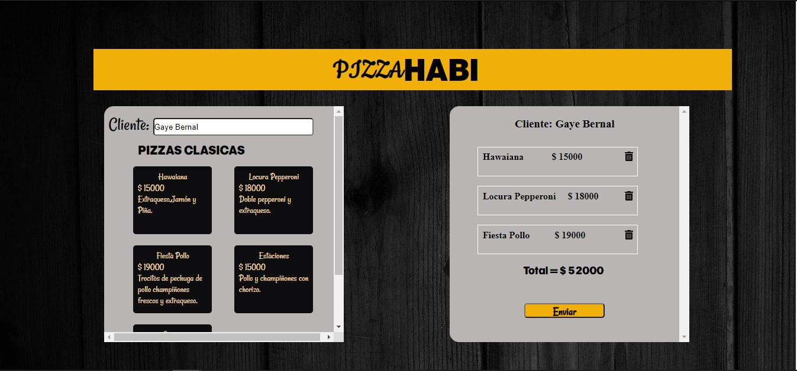

# Pizza Habi

## Indice

- [Pizza Habi](#pizza-habi)
  - [Indice](#indice)
  - [1. Preámbulo](#1-preámbulo)
  - [2. Resumen del desarrollo del proyecto](#2-resumen-del-desarrollo-del-proyecto)
  - [3. Lenguajes y Librerias usadas](#3-lenguajes-y-librerias-usadas)
    - [HTML y CSS](#html-y-css)
    - [JavaScript](#javascript)
    - [JSON](#json)
    - [Estructura del código y guía de estilo](#estructura-del-código-y-guía-de-estilo)
    - [React](#react)
    - [UX](#ux)
  - [4. Vista Final](#4-vista-final)
  - [5. Ver el proyecto](#5-ver-el-proyecto)

## 1. Preámbulo

Esta prueba se trata de construir una interfaz web usando el *framework* (ReactJS), Donde me ayuda a mantener la interfaz y el estado sincronizados.

Elegi esta tecnologia ya que no solo importo un pedacito de código para reusarlo, si no que adopto una **arquitectura**, una serie de **pincipios de diseño**, unas **abastracciones**, un **vocabulario**, una **comunidad**, etc...

Como desarrolladora Front-end, estos kits de desarrollo pueden resultar de grana ayuda para implementar rápidamente características en los proyectos que desarrolle.

## 2. Resumen del desarrollo del proyecto

Tras leer el [PDF] relize un sketch de alta fidelidad en figma, Incie el proyecto con Vsc, donde instale el Framework, hice la instalacion de las librerias necesarias, dividi el codigo y desarrolle lo necesario.

## 3. Lenguajes y Librerias usadas

  ### HTML y CSS

* [X] [Uso de HTML semántico.]
* [X] [Uso de selectores de CSS.]
* [X] [Uso de flexbox en CSS.]
  
### JavaScript

  * [X] Uso de condicionales
  * [X] Uso de funciones
  * [X] Manipular arrays
  * [X] Manipular objects
  * [X] Uso de callbacks.

### JSON

  * [X] Creacion de JSON
  * [X] Consumo de API

  ### Estructura del código y guía de estilo

   * [X] Organizar y dividir el código en módulos
   * [X] Uso de identificadores descriptivos
   * [X] Uso de condicionales

   ### React

   * [X] JSX
   * [X] Eventos en React.
   * [X] Listas y keys.
   * [X] Elevación de estados.
   * [X] Hooks.
   * [X] React Router.

  ### UX

   * [X] Diseñar la aplicación pensando y entendiendo al usuario.
   * [X] Aplicar los principios de diseño visual (contraste, alineación, jerarquía)

## 4. Vista Final

## 5. Ver el proyecto

  * [X] Clonar proyecto.
  * [X] Ejecutarl con npm start.

